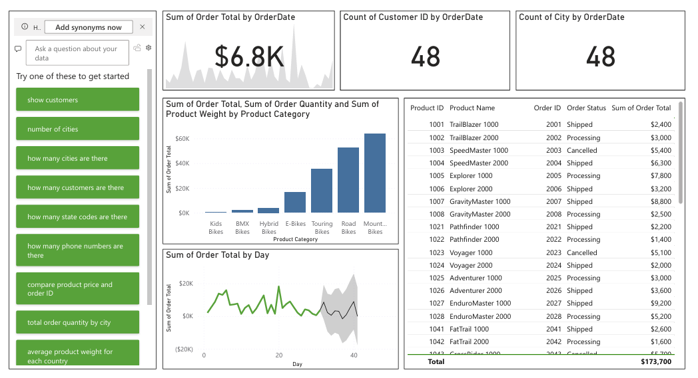

# 📊 AdventureWorks Power BI Executive Sales Dashboard
### 🎓 Microsoft Power BI Data Analyst Specialization - Portfolio Project

---

## 📑 Table of Contents
- [Overview](#overview)
- [Business Task](#business-task)
- [Dataset Detail](#dataset-detail)
- [Tools & Technologies Used](#tools--technologies-used)
- [Skills Demonstrated](#skills-demonstrated)
- [Project Workflow](#project-workflow)
- [Results](#results)
- [Key Findings](#key-findings)
- [About this Project](#about-this-project)

---

## 🔍 Overview
This project presents an **executive-level sales dashboard** built using Microsoft Power BI on the **AdventureWorks** dataset.  
The dashboard transforms raw sales and customer data into **clear KPIs, trends, forecasts, and insights** to support strategic business decision-making.

---

## 🎯 Business Task
Enable AdventureWorks executives to:
- Monitor overall sales performance
- Track customer reach and geographic presence
- Identify top and underperforming product categories
- Analyze sales trends and forecast future performance
- Interact with data using natural language (Q&A)

---

## 🗂️ Dataset Detail
**Source:** AdventureWorks dataset  

**Tables Used:**
- **Sales**
  - Order Date, Order Total, Order Quantity, Product details, Order Status
- **Customers**
  - Customer ID, City, Country, Membership Tier, Demographics

The dataset represents **transactional sales data combined with customer attributes**.

---

## 🛠️ Tools & Technologies Used
- **Microsoft Power BI Desktop**
- **Power BI Analytics & Forecasting**
- **Q&A Natural Language Visual**

---

## 🧠 Skills Demonstrated
- Data modeling & relationship management
- KPI design for executive reporting
- Sales trend analysis & forecasting
- Business storytelling with dashboards
- Data visualization best practices
- Natural language analytics (Q&A)
- Executive-focused dashboard layout

---

## 🧩 Project Workflow
1. **Data Understanding**
   - Reviewed Sales and Customers tables and key business fields

2. **Data Preparation**
   - Verified data types and ensured clean, analysis-ready data in Power BI

3. **Core Visualizations**
   - Built table, column chart, and line chart to analyze products, categories, and sales trends

4. **KPI Development**
   - Created KPIs for Total Sales, Customer Reach, and Geographic Presence

5. **Forecasting**
   - Applied monthly sales forecasting with seasonality and high confidence interval

6. **Natural Language Analytics**
   - Enabled Q&A visual to allow executives to ask business questions directly

7. **Executive Layout & Design**
   - Organized visuals into a clean, executive-friendly dashboard

---

## 📈 Results

| 1. Executive Sales Overview |
|-----------------------------|
|  |
| One-page executive dashboard presenting KPIs, sales trends, forecasting, and interactive insights. |

---

## 🔑 Key Findings
- **Long Beach** recorded the lowest average order value, indicating potential pricing or demand issues
- **BMX Bikes** showed the highest average order quantity among product categories
- **Downhill** product subcategory had the highest product weight, impacting logistics and shipping costs
- Sales trends reveal clear seasonality, supporting reliable monthly forecasting

---

## ℹ️ About this Project
- This project was developed as the **final portfolio project** for the  
**Microsoft Power BI Data Analyst Professional Certificate**.  
- It is designed to reflect **real-world executive reporting standards** and demonstrates how Power BI can be used to convert raw data into **actionable business insights**.
